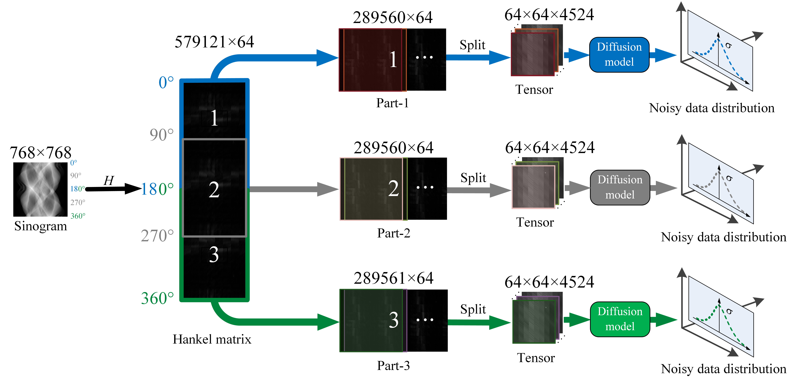
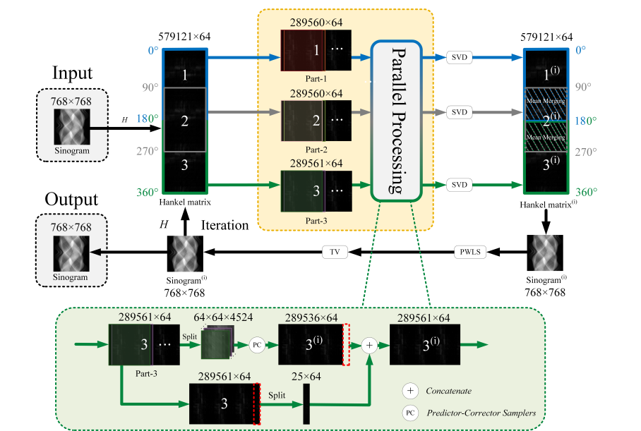
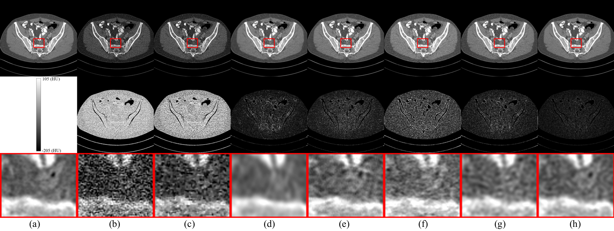

Paper: Low-rank Angular Prior Guided Multi-diffusion Model for Few-shot Low-dose CT Reconstruction
Authors: Wenhao Zhang, Bin Huang, Shuyue Chen, Xiaoling Xu, Weiwen Wu, Qiegen Liu

The code and the algorithm are for non-comercial use only. Copyright 2024, School of Information Engineering, Nanchang University.

Low-dose computed tomography (LDCT) is essential in clinical settings to minimize radiation exposure; however, reducing the dose often leads to a significant decline in image quality. Additionally, conventional deep learning approaches typically require large datasets, raising con-cerns about privacy, costs, and time constraints. To ad-dress these challenges, a few-shot low-dose CT reconstruc-tion method is proposed, utilizing low-Rank Angular Pri-or (RAP) multi-diffusion model. In the prior learning phase, projection data is transformed into multiple con-secutive views organized by angular segmentation, allow-ing for the extraction of rich prior information through low-rank processing. This structured approach enhances the learning capacity of the multi-diffusion model. Dur-ing the iterative reconstruction phase, a stochastic differ-ential equation solver is employed alongside data con-sistency constraints to iteratively refine the acquired pro-jection data. Furthermore, penalized weighted least-squares and total variation techniques are integrated to improve image quality. Results demonstrate that the re-constructed images closely resemble those obtained from normal-dose CT, validating the RAP model as an effec-tive and practical solution for artifact and noise reduc-tion while preserving image fidelity in low-dose situation.

## The training pipeline of RAP

## The pipeline for iterative reconstruction stage of RAP

## Reconstruction results from 1e4 noise level using different methods

